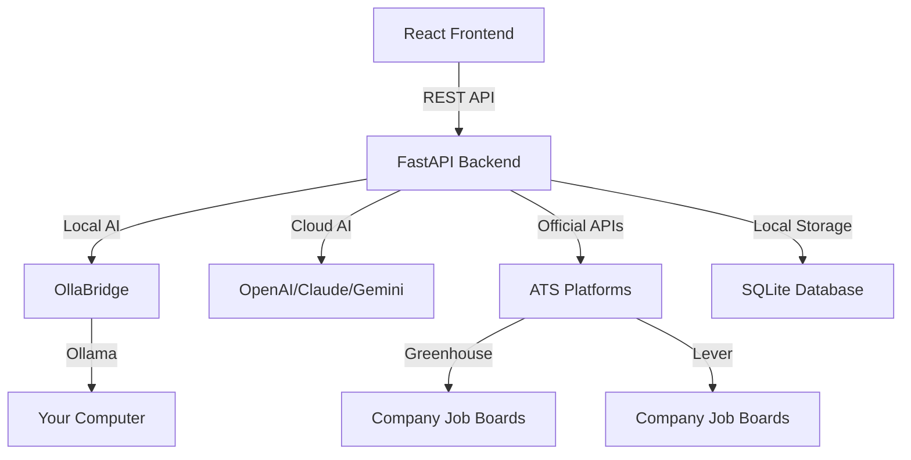

<div align="center">

# 💼 JobCraft

### Your Intelligent Job Application Copilot

**Compliance-First • Privacy-First • Human-in-the-Loop**

[](https://github.com/ruslanmv/jobcraft/stargazers)
[](LICENSE)
[](https://www.python.org/)
[](https://reactjs.org/)
[](https://fastapi.tiangolo.com/)

[🚀 Features](#-features) • [📦 Installation](#-installation) • [🎯 Quick Start](#-quick-start) • [📖 Documentation](#-documentation) • [🤝 Contributing](#-contributing)

</div>

---

## 🌟 Overview

**JobCraft** is a human-in-the-loop job application assistant designed to help you craft personalized application packets while staying **100% compliant** with platform terms of service.

Unlike traditional automation tools, JobCraft operates in the **safe zone**:
- ✅ No web scraping
- ✅ No automated submissions
- ✅ No cookie/token theft
- ✅ Human-in-the-loop required
- ✅ Uses official APIs only

### 🎯 What Makes JobCraft Different?

<table>
<tr>
<td width="33%" align="center">

<br><br>
<b>Platform-Safe Operations</b>
<br>
Only uses official ATS APIs (Greenhouse, Lever, Ashby). No scraping or automation.
</td>
<td width="33%" align="center">

<br><br>
<b>Your Computer, Your AI</b>
<br>
Run AI locally via OllaBridge. Your data never leaves your machine.
</td>
<td width="33%" align="center">

<br><br>
<b>Built for EU Markets</b>
<br>
Defaults for IT, DE, GB, CH with localized formatting.
</td>
</tr>
</table>

---

## ✨ Features

### 🎨 **Modern Dashboard**
Professional interface with real-time compliance monitoring and activity tracking.

### 🔍 **Compliant Job Discovery**
- **Greenhouse** integration
- **Lever** integration
- **Ashby** support
- Country-specific filtering (🇮🇹 🇩🇪 🇬🇧 🇨🇭)
- No scraping, official APIs only

### 🤖 **AI-Powered Workbench**
- **Cover Letter Generation** - Tailored to each role
- **Resume Bullet Points** - Optimized for ATS
- **Screening Questions** - AI-assisted responses
- **Pre-submission Checklist** - Never miss a detail

### 📊 **Application Tracker**
- Pipeline management
- Status tracking
- Email digest notifications
- Local storage (your data stays private)

### ⚙️ **Flexible AI Providers**
| Provider | Type | Privacy | Cost |
|----------|------|---------|------|
| 🖥️ **OllaBridge** | Local | ⭐⭐⭐⭐⭐ | Free |
| 🤖 OpenAI GPT-4 | Cloud | ⭐⭐⭐ | Paid |
| 🧠 Claude 3.5 | Cloud | ⭐⭐⭐ | Paid |
| ✨ Gemini Pro | Cloud | ⭐⭐⭐ | Paid |
| 🔵 IBM watsonx | Cloud | ⭐⭐⭐⭐ | Paid |

**Recommended:** Use **OllaBridge** for 100% privacy - your AI runs on your computer.

---

## 🏗️ Architecture



---

## 🛠️ Tech Stack

### Frontend


### Backend


### AI Integration


---

## 📦 Installation

### Prerequisites

- **Python 3.11+** ([Download](https://www.python.org/downloads/))
- **Node.js 18+** ([Download](https://nodejs.org/))
- **uv** (Python package manager) - `pip install uv`
- **OllaBridge** (optional, for local AI) - `pip install ollabridge`

### 🚀 Quick Install

```bash
# Clone the repository
git clone https://github.com/ruslanmv/jobcraft.git
cd jobcraft

# Install dependencies
make install

# Copy environment file
cp .env.example .env

# Edit .env with your configuration
nano .env
```

### 🔧 Configuration

Edit `.env` to configure your setup:

```bash
# === AI Provider Configuration ===

# Option 1: OllaBridge (Recommended - 100% Private)
OLLABRIDGE_BASE_URL=http://localhost:11435
OLLABRIDGE_API_KEY=your-ollabridge-key-here

# Option 2: Cloud AI Providers (Optional)
OPENAI_API_KEY=sk-...
ANTHROPIC_API_KEY=sk-ant-...
GEMINI_API_KEY=...

# === Regional Defaults (Europe-First) ===
DEFAULT_COUNTRIES=IT,DE,GB,CH
DEFAULT_LOCALE=en-GB
DEFAULT_TIMEZONE=Europe/Rome

# === Email Configuration (Optional) ===
SMTP_HOST=smtp.gmail.com
SMTP_PORT=587
SMTP_USER=your-email@gmail.com
SMTP_PASS=your-app-password
```

---

## 🎯 Quick Start

### 1️⃣ Start OllaBridge (Local AI - Recommended)

```bash
# Install OllaBridge
pip install ollabridge

# Start OllaBridge
ollabridge start

# Or with internet sharing (for remote access)
ollabridge start --share

# Copy the API key that's displayed
```

### 2️⃣ Start JobCraft

```bash
# Start both frontend and backend
make dev
```

The application will open at:
- 🎨 **Frontend:** http://localhost:5173
- ⚡ **API:** http://localhost:8000
- 📚 **API Docs:** http://localhost:8000/docs

### 3️⃣ First Time Setup

1. **Connect OllaBridge** (Settings → AI Engine)
2. **Upload your CV/Resume**
3. **Set your target region** (IT, DE, GB, CH)
4. **Start discovering jobs!**

---

## 📖 Usage

### 🔍 Discovering Jobs

```bash
# Via UI: Navigate to "Find Jobs" → Enter company slug → Fetch Jobs

# Via API:
curl http://localhost:8000/api/discover/greenhouse/stripe?countries=IT,DE,GB
```

### 📝 Crafting Application Packets

1. Go to **Workbench**
2. Enter job details (or import from Discovery)
3. Upload your CV
4. Select target country
5. Click **"Craft Packet"**

JobCraft will generate:
- ✅ Tailored cover letter
- ✅ Optimized resume bullets
- ✅ Screening question responses
- ✅ Pre-submission checklist

### 📊 Tracking Applications

```bash
# Add job to tracker
POST /api/tracker/jobs
{
  "title": "Senior Frontend Engineer",
  "company": "TechNova",
  "url": "https://...",
  "status": "discovered"
}

# Get all tracked jobs
GET /api/tracker/jobs

# Send email digest
POST /api/digest/email?to_email=you@example.com
```

---

## 🚢 Deployment

### Option 1: Docker Container (Recommended for Production)

**Deploy Full-Stack Application in a Single Container**

#### Quick Start with Docker

```bash
# Build the container
make build-container

# Run locally
make run-container

# View logs
make logs-container

# Stop container
make stop-container
```

#### Deploy to Render

**Automated deployment with one click:**

1. Push your code to GitHub
2. Create new Web Service on [Render](https://dashboard.render.com/)
3. Select your repository
4. Render auto-detects the Dockerfile
5. Add environment variables:
   ```
   OLLABRIDGE_BASE_URL=https://your-tunnel-url
   OLLABRIDGE_API_KEY=sk-ollabridge-xxxxx
   ```
6. Click "Create Web Service"

**Or use render.yaml:**
```bash
# render.yaml is included - Render will auto-configure everything
git push origin main
```

#### Deploy to Railway

```bash
# Install Railway CLI
npm i -g @railway/cli

# Deploy
railway init
railway up
```

#### Deploy to Docker Hub

```bash
# Set your username
export DOCKERHUB_USERNAME=your-username

# Build and publish
make publish

# Pull from anywhere
docker pull docker.io/your-username/jobcraft:latest
```

#### Environment Variables

At least one LLM provider is required:

| Variable | Description | Example |
|----------|-------------|---------|
| `OLLABRIDGE_BASE_URL` | OllaBridge tunnel URL | `https://abc.ollabridge.com` |
| `OLLABRIDGE_API_KEY` | API key from ollabridge | `sk-ollabridge-xxxxx` |
| `DEFAULT_PROVIDER` | Active provider | `ollabridge` |
| `PORT` | Application port | `8000` |

📖 **Complete Guide:** See [DOCKER_DEPLOYMENT.md](DOCKER_DEPLOYMENT.md) for detailed instructions.

---

### Option 2: Separate Frontend & Backend

#### Deploy Frontend to Vercel

**Using Vercel Dashboard (Easiest)**

1. Go to [Vercel Dashboard](https://vercel.com/new)
2. Import your GitHub repository
3. **Set Root Directory to `frontend`**
4. Click Deploy

**Using Vercel CLI**

```bash
# Install Vercel CLI globally
npm i -g vercel

# Deploy from project root
vercel

# When prompted, set directory to: frontend
# For production
vercel --prod
```

📖 **Detailed Guide:** See [VERCEL_DEPLOYMENT.md](VERCEL_DEPLOYMENT.md) for complete instructions.

#### Deploy Backend Only

**Using backend-only Docker image:**

```bash
# Build backend image
make build-backend

# Deploy to any platform
docker run -p 8000:8000 \
  -e OLLABRIDGE_API_KEY=sk-xxx \
  jobcraft:backend-latest
```

---

## 🔐 Privacy & Compliance

### What JobCraft DOES:
✅ Uses official ATS APIs (Greenhouse, Lever, Ashby)
✅ Requires human review before any submission
✅ Stores data locally (SQLite)
✅ Supports 100% local AI (OllaBridge)
✅ Respects platform Terms of Service

### What JobCraft DOES NOT DO:
❌ Web scraping (LinkedIn, Indeed, etc.)
❌ Automated submissions
❌ Cookie/token theft
❌ Bypassing platform restrictions
❌ Storing credentials

**JobCraft is designed to assist, not automate. You remain in control.**

---

## 📚 API Reference

### Discovery Endpoints

```bash
# Greenhouse
GET /api/discover/greenhouse/{board_token}?countries=IT,DE

# Lever
GET /api/discover/lever/{company_slug}?countries=GB,CH
```

### Packet Generation

```bash
POST /api/jobcraft/packet
Content-Type: multipart/form-data

- provider: "ollabridge"
- job_title: "Senior Frontend Engineer"
- company: "TechNova"
- job_description: "..."
- country: "IT"
- cv_file: <file>
```

### Tracker

```bash
# Add job
POST /api/tracker/jobs

# List jobs
GET /api/tracker/jobs

# Update status
PUT /api/tracker/jobs/{job_id}
```

Full API documentation available at http://localhost:8000/docs

---

## 🤝 Contributing

We welcome contributions! Here's how you can help:

### 🐛 Report Bugs
Open an issue with:
- Clear description
- Steps to reproduce
- Expected vs actual behavior
- Environment details

### 💡 Suggest Features
Open an issue with:
- Feature description
- Use case
- Mockups (if applicable)

### 🔧 Submit Pull Requests

1. Fork the repository
2. Create a feature branch: `git checkout -b feature/amazing-feature`
3. Commit your changes: `git commit -m 'Add amazing feature'`
4. Push to the branch: `git push origin feature/amazing-feature`
5. Open a Pull Request

### 📋 Development Setup

```bash
# Backend development
cd backend
uv venv
source .venv/bin/activate  # or `.venv\Scripts\activate` on Windows
uv pip install -e ".[dev]"

# Frontend development
cd frontend
npm install
npm run dev
```

---

## 🗺️ Roadmap

- [ ] **v1.1** - Chrome Extension for easy job import
- [ ] **v1.2** - Multi-language support (German, Italian, French)
- [ ] **v1.3** - Interview preparation mode
- [ ] **v1.4** - Network analysis and referral tracking
- [ ] **v2.0** - Mobile app (iOS/Android)

---

## 📄 License

This project is licensed under the **MIT License** - see the [LICENSE](LICENSE) file for details.

---

## 🙏 Acknowledgments

- **[OllaBridge](https://github.com/ruslanmv/ollabridge)** - Local AI bridge for privacy-first LLM access
- **[Ollama](https://ollama.ai)** - Local LLM runtime
- **[FastAPI](https://fastapi.tiangolo.com/)** - Modern Python web framework
- **[React](https://react.dev/)** - UI framework
- **[Tailwind CSS](https://tailwindcss.com/)** - Utility-first CSS

---

## 💬 Community & Support

<table>
<tr>
<td align="center" width="25%">
<a href="https://github.com/ruslanmv/jobcraft/issues">

</a>
</td>
<td align="center" width="25%">
<a href="https://github.com/ruslanmv/jobcraft/issues">

</a>
</td>
<td align="center" width="25%">
<a href="https://github.com/ruslanmv/jobcraft/discussions">

</a>
</td>
<td align="center" width="25%">
<a href="https://github.com/ruslanmv/jobcraft/stargazers">

</a>
</td>
</tr>
</table>

---

<div align="center">

### 🌟 Star History

[](https://star-history.com/#ruslanmv/jobcraft&Date)

---

### Made with ❤️ for job seekers who value compliance and privacy

**If JobCraft helped you land your dream job, please star this repo!**

[](https://github.com/ruslanmv/jobcraft/stargazers)

[⬆ Back to Top](#-jobcraft)

</div>
